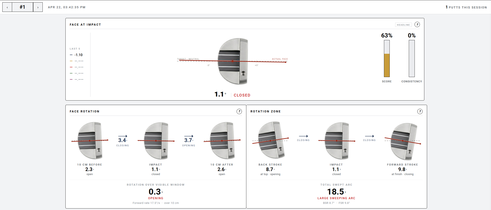
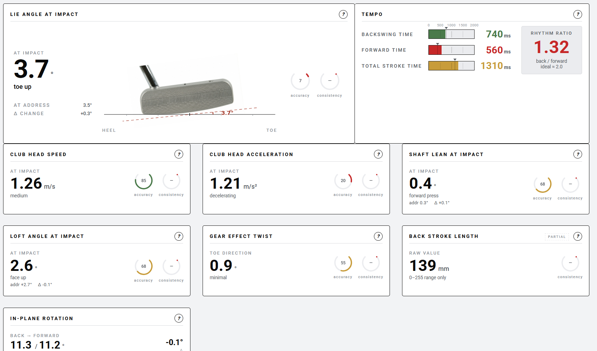

# Vertex Desktop

Unofficial Windows desktop app for the [Vertex Golf SmartCore](https://www.vertexgolf.com) BLE putting sensor. The sensor normally pairs only with the vendor's iOS/Android app — this project lets it talk to a desktop instead, with a SAM PuttLab-style analytical dashboard that's legible across the room (projector-friendly).

## Screenshots





## Features

- Live BLE connection to the SmartCore sensor (no vendor app required)
- 20+ decoded putt metrics including face change, face angle at three stages around impact, rotation zone, tempo, rhythm, club head speed, gear effect twist, shaft lean, lie angle, loft angle
- Device-side static-pose calibration (face-down on a book for face cal, shaft against a wall for lie cal)
- Battery reading from the BLE advertisement (no connection required)
- Left/right-handed putter visuals with correct orientation and angle overlays
- Session save/load, CSV export, putt-by-putt navigation
- Synthetic-putt generator for UI work without the physical sensor
- Auto-retry on stale Windows Bluetooth bonds

## Install

### Option A — Download the prebuilt Windows .exe

Grab the latest Windows build from the GitHub **Releases** page. The single-file `VertexDesktop.exe` is ~50 MB and needs no Python install. Windows may warn about an unrecognized publisher — that's expected for an unsigned hobby project.

### Option B — Run from source

```sh
pip install -r requirements.txt
python vertex_app_v2.py
```

Opens `http://127.0.0.1:8765/` in the default browser.

Tested on Windows 11 with Python 3.12 + `bleak` 3.x. BLE requires an adapter Windows recognizes as LE-capable (most built-in radios from 2019+ work; some Realtek/Mediatek USB dongles misbehave).

## Using it

1. Attach the sensor to your putter shaft (~6" up from the head, as the vendor recommends — the firmware's club-head-speed scale factor assumes that placement).
2. Launch the app and click **Connect**. If the sensor doesn't appear, wake it by moving the putter; it sleeps to save battery.
3. Pick **Left** or **Right** handed in the settings gear to match your putter visual.
4. Open the calibration panel and run both poses once per setup:
   - **Face calibration** — putter face-down on a flat surface (e.g. a hardcover book).
   - **Lie calibration** — shaft flat against a wall, head on the ground.
5. Putt. Each stroke appears on the dashboard within ~1 second of impact.

## Repository layout

```
vertex_app_v2.py       # backend: BLE worker + HTTP/SSE server
ui.html                # single-file frontend (HTML + CSS + JS)
vertex_desktop.py      # pywebview launcher (used by the .exe build)
assets/                # putter PNGs
docs/screenshots/      # dashboard screenshots
requirements.txt       # bleak, pywebview, pywin32 (Windows)
build.ps1              # PyInstaller invocation for local builds
.github/workflows/     # CI: builds .exe on every push, cuts Release on tag
PROTOCOL.md            # BLE protocol writeup
```

## Disclaimer

This is an independent reverse-engineering / interop project for personal desktop use. It is not affiliated with or endorsed by Vertex Golf. The Vertex Golf app, hardware, and trademarks are property of their respective owners.
